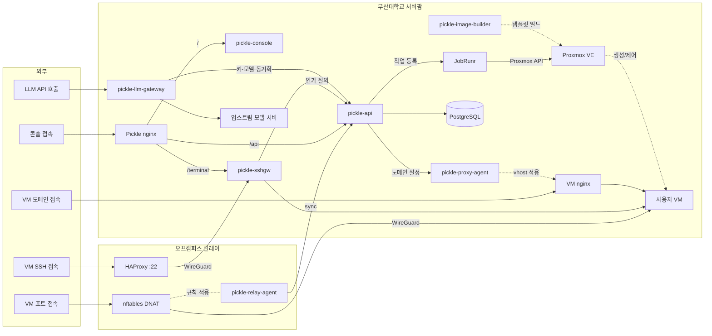

# pickle-llm-gateway

부산대학교 클라우드 플랫폼(Pickle)의 교내 LLM API 게이트웨이입니다. 학생 코드가 보내는
OpenAI 호환 요청을 받아 API Key를 검증하고 사용량 한도를 적용한 뒤, 업스트림 모델 서버로
전달합니다. 학생이 쓰는 주소는 `https://llm.pcl.kr/v1`이고, 발급받은 Key를 OpenAI SDK의
`base_url`과 `api_key`에 그대로 넣으면 됩니다.

## 요청 경로

```
학생 코드 (OpenAI SDK + API Key)
    │  POST /v1/chat/completions, GET /v1/models
    ▼
llm-gateway ── 키 검증 · 한도 적용 · 모델명 변환 · 사용량 기록
    │
    ▼
업스트림 모델 서버 (OpenAI 호환 API)
```

학생 코드에는 공개 모델명만 보입니다. 실제 모델과 업스트림 주소는 게이트웨이 설정에만
있으므로, 업스트림을 교체해도 학생 코드는 바뀌지 않습니다.

## 주요 기능

이 게이트웨이가 맡는 부분은 아래와 같습니다.

- **API Key 검증**: 발급된 Key만 통과시키고, 폐기와 정지, 만료 상태를 반영합니다.
- **사용량 한도**: Key마다 분당 요청 횟수와 토큰 사용량, 동시 요청 수를 제한합니다.
- **모델 이름 분리** — 요청과 응답의 모델명을 공개 이름으로 유지합니다.
- **사용량 계측**: 요청마다 토큰 사용량과 처리 결과를 기록합니다. 프롬프트와 응답 본문은
  기록하지 않습니다.
- **본문 보관(선택)**: Key마다 따로 켤 수 있고 기본은 꺼져 있습니다. 켠 Key의 요청·응답
  본문만 관리 API로 전달합니다.

## 동작 방식

인증 상태는 스냅샷 문서 한 개로 관리합니다. 어떤 Key가 있고 어떤 모델을 서빙하며 한도가
얼마인지가 JSON 문서 하나에 들어 있고, 게이트웨이는 이 문서를 통째로 읽어 원자적으로
교체합니다. 문서가 바뀌면 폴링 주기 안에 반영되므로, Key 폐기는 수 초 안에 적용됩니다.
세대 번호가 뒤로 가는 문서는 거부합니다. 폐기를 조용히 되돌릴 수 있기 때문입니다.
최고 세대 번호는 문서 옆 `snapshot.json.highwater` 파일에 남으므로, 재시작 뒤에 예전
문서가 되살아나도 거부합니다. 모델의 `upstreamRef`가 설정에 없는 업스트림을 가리키면
손으로 관리하는 파일에서는 그 문서의 적재를 거부하고, 관리 API가 준 문서에서는 그 모델
항목만 버립니다(아래). 어느 쪽이든 오타가 요청 시점이 아니라 적재 시점에 드러납니다.

`models`와 `keys` 항목 안의 모르는 필드는 어느 경우에도 무시합니다. 이후 관리 API가 항목에
필드를 하나 더해도 옛 게이트웨이가 문서를 통째로 버리지 않고 아는 만큼 계속 집행하기
위해서입니다. 문서 최상위는 **누가 썼는지에 따라** 다릅니다 — 손으로 관리하는 파일에서는
모르는 이름이 오타이므로 적재를 거부하고(`serviceEnable`이 조용히 무시되면 서비스가 켜진
채로 남습니다), 관리 API가 준 문서에서는 새 버전이 더한 항목일 수 있으므로 모르는 이름을
무시합니다. 그렇지 않으면 필요하지도 않은 필드 하나 때문에 폐기 반영이 멈춥니다. 모델의 `visibility`가 `RESTRICTED`이면
그 모델을 `allowedModels`에 명시한 키만 접근할 수 있고, 비어 있는 `allowedModels`는
`PUBLIC` 모델만 허용합니다. 새 모델을 넣어도 기존 키에 자동으로 열리지 않습니다.

모델에는 **예산 축**(`budgetAxis`)이 있습니다. `TOKEN`(기본값, 필드가 없으면 이 값)은
교내 서빙 모델의 축으로, 문서의 `quotaExhausted` 플래그(일일 토큰 한도)가 이 축의
모델에만 적용됩니다. `CREDIT`은 상용 모델의 축으로, 요청에 **그 Key 전용 업스트림
자격증명**(`upstreamCredentials`의 해당 업스트림 항목)이 있어야 하고 금액 한도는 그
자격증명을 발급한 쪽이 강제합니다. CREDIT 축에서는 게이트웨이 공용 env 자격증명을
절대 대신 쓰지 않고, 자격증명이 없는 Key는 거절됩니다.
축은 모델 행의 속성이지 업스트림 종류가 아니므로, 같은 모델의 업스트림을 교체해도
축은 바뀌지 않습니다.

자격증명이 없는 이유는 두 가지이고 거절도 둘로 나뉩니다. 금액 한도를 받은 적이 없으면
`credit_unavailable`(403)이고, 한도는 부여됐는데 그 Key의 업스트림 자격증명이 아직
만들어지지 않았으면 `credit_pending`(503)입니다. 뒤쪽은 관리 API가 문서에
`creditPending`으로 표시해 주는 상태이고 저절로 끝나므로, 응답에 `Retry-After`가
실립니다. 앞쪽은 사람이 한도를 신청해야 풀리므로 헤더가 없습니다. 문서에
`creditPending`이 없는 관리 API를 쓰면 두 경우 모두 `credit_unavailable`이 됩니다.

문서 최상위의 `passthroughRef`가 설정돼 있으면, 카탈로그에 없는 모델명은 그 업스트림으로
**이름 그대로** 전달됩니다(패스스루). 패스스루 모델은 항상 CREDIT 축으로 취급되므로 Key
자격증명이 없으면 거절되고, `pickle-` 접두 이름은 대소문자와 무관하게 패스스루되지 않습니다.
교내 모델명의 오타가 과금 요청이 되지 않도록 404로 남기기 위해서입니다. 공개 모델명은
소문자로 쓰고 조회는 대소문자를 구분하며, `pickle-` 접두는 교내(자체 서빙) 모델 전용입니다.
과거에 같은 용도로 쓰던 `pnu-` 접두도 예약이 유지되어 패스스루되지 않습니다. API Key
평문도 같은 `pickle-` 접두를 쓰지만 전달 위치가 다릅니다 — Key는 Authorization 헤더,
모델명은 요청 본문의 `model` 필드로만 해석되므로 접두가 같아도 서로 혼동되지 않습니다.
Key별 자격증명 발급과 갱신은 관리 API 모드의 몫입니다. 손으로 관리하는 파일 모드는 토큰
축 운영을 전제하며, `passthroughRef`를 파일에 쓸 때는 해당 업스트림 env 블록을 먼저
설정해야 합니다(없으면 문서 적재가 거부됩니다).

각 응답은 `X-Request-Id` 헤더로 그 요청의 기록 식별자를 돌려주므로 문의에 인용할 수
있습니다. `/healthz`는 세대·스냅샷 나이·리로드 정체 여부를 함께 반환합니다.

문서는 두 곳에서 올 수 있습니다. 기본값은 운영자가 관리하는 **로컬 파일**이고,
`LLMGW_SNAPSHOT_SOURCE=http`로 두면 **관리 API에서 받아옵니다**. 관리 API 모드에서는 **적재에 성공한**
문서만 로컬에 캐시하므로, 관리 API가 닿지 않는 동안 재시작해도 마지막으로 실제 적용했던
상태로 기동합니다. 문서 형식은 두 경우가 같습니다.

거부된 문서는 계속 다시 제시되므로 `/healthz`의 실패 횟수가 계속 올라갑니다 — 스냅샷
기록이 깨진 상태가 조용히 정상으로 보이지 않습니다.

**문서 하나가 통째로 거부되면 그동안 폐기와 정지가 반영되지 않습니다.** 그래서 관리 API가
준 문서에서는 게이트웨이가 다룰 수 없는 값(모르는 상태 이름, 이 호스트에 설정되지 않은
업스트림)을 만나도 그 항목만 버리고 나머지를 적용하며, 버린 개수를 `/healthz`와 지표에
드러냅니다. 키 한 개가 사라지면 그 키가 막히고(안전한 쪽), 모델 한 개가 사라지면 그 모델만
없어지지만, 문서 전체가 얼어붙으면 폐기한 키가 계속 동작합니다. 반면 손으로 관리하는
파일에서는 같은 상황이 방금 한 편집의 오류이므로 적재를 실패시킵니다. 파싱 자체가 안 되는
문서, `serviceEnabled`가 빠진 문서, `models`와 `keys` 중 한쪽이라도 빠진 문서는 어느
쪽에서도 거부합니다 — 각각 서비스 전체 점검 모드와 전 키 무효를 뜻하게 되기 때문입니다.
둘 다 빠진 문서도 마찬가지입니다. 관리 API에서는 그 형태가 "변경 없음"을 뜻하지만 전송
계층이 걸러내므로 여기까지 오지 않고, 파일에서는 잘렸거나 쓰다 만 문서일 수밖에 없습니다.

요청 처리는 이렇게 흐릅니다. Authorization 헤더의 Key를 sha256으로 해시해 스냅샷에서
찾고, 한도를 확인한 뒤 요청 본문의 모델명을 실제 모델로 바꿔 업스트림에 전달합니다.
스트리밍 응답은 조각 단위로 그대로 흘려보내면서 모델명만 공개 이름으로 되돌립니다.
지원하지 않는 파라미터는 이름을 밝혀 거부하므로, 업스트림을 바꿔도 학생 코드가 보내는
요청의 의미는 달라지지 않습니다.

토큰 사용량은 업스트림이 돌려주는 usage 값으로 기록합니다. 스트리밍 요청은 업스트림에
`stream_options.include_usage`를 강제로 켜서 마지막 조각의 사용량을 받되, 학생이 직접
요청하지 않았다면 그 조각은 계측에만 쓰고 응답으로는 보내지 않습니다. 사용량을 얻지
못한 채 끝난 요청은 크기 기반 추정치를 `estimated` 표시와 함께 기록합니다. 기록은 하루 단위
JSONL 파일에 쌓입니다. 모델을 정상적으로 결정한 요청은 그 시점의 예산 축(`TOKEN` 또는
`CREDIT`)도 함께 기록하며, 모델을 결정하지 못한 요청에는 이 필드가 없습니다. 이 파일은
**발송 대기함**이기도 합니다 — 전송을 켜면 마지막으로
보낸 지점부터 이어서 관리 API로 배치 전송하고, 실패하면 물러섰다 다시 시도합니다. 항목마다
고유한 `eventUuid`가 있어 같은 항목이 두 번 도착해도 중복으로 쌓이지 않습니다.

**배포 순서:** `budgetAxis`를 보내는 게이트웨이 바이너리는 이 nullable 필드를 저장하는 관리
API와 DB schema가 먼저 배포된 뒤 배포합니다. 반대 순서에서는 관리 API가 새 필드를 무시하고
2xx로 받아 `eventUuid` 중복 제거와 게이트웨이 checkpoint를 확정하거나, 400·409·413·422로
거부해 발송기가 해당 batch를 영구 결함으로 건너뜁니다. 두 경우 모두 나중에 같은 event의
예산 축을 다시 저장할 기회가 없어 값이 복구되지 않습니다.

본문 보관은 사용량 기록과 다른 길로 흐릅니다. 켠 Key의 요청·응답 본문은 메모리에만 담겼다가
관리 API로 곧장 나가며, **사용량 파일에는 어떤 경우에도 적히지 않습니다**. 전달 통로가 없으면
아무것도 담지 않고, 보낼 곳이 밀리면 담아 두는 대신 버립니다. 사용량 기록은 그와 무관하게
남으므로 계정과 한도는 영향을 받지 않습니다.

업스트림이 실패하면 응답이 시작되기 전까지는 다시 시도하고, 모델에 `fallbackRef`가 있으면
그쪽으로 넘깁니다. 다만 **응답 대기 중 시간이 초과된 요청은 다시 보내지 않습니다** — 업스트림이
이미 답을 만들고 있을 수 있어 두 번 청구되기 때문입니다. 요청 자체가 잘못됐다는 응답(400)도
다시 시도하지 않고(어디서 보내도 같은 답), 요청 빈도 제한(429)에 걸리면 같은 곳을 즉시 다시
두드리지 않고 예비 업스트림으로 넘어가며 학생에게는 혼잡 상태로 알립니다. 연속으로 실패한 업스트림은 잠시 뒤로 미뤄 두고
다른 곳을 먼저 시도합니다.

한도에 걸린 응답에는 `Retry-After`를, 통과한 응답에는 남은 분당 요청 수를 헤더로 실어
클라이언트가 언제 다시 오면 되는지 알 수 있게 합니다.

`LLMGW_ADMIN_LISTEN`을 지정하면 그 주소에서 진행 중 요청 수와 상태별 집계, 토큰 누계,
버려진 스냅샷 항목 수를 볼 수 있습니다. 학생이 접속하는 주소에는 이 경로가 없습니다.

관리 API 모드에서는 같은 값들을 폴링 요청에 실어 보냅니다. 관리 API는 게이트웨이를
호출하지 않으므로, 이 요청에 없는 사실은 관리 API가 알 방법이 없습니다 — 적용된 세대가
멈춰 있다는 것만으로는 이유를 알 수 없어서, 마지막 오류와 버린 항목 수, 이 빌드가 읽을 수
있는 문서 형식 번호, 설정된 업스트림 이름을 함께 보냅니다. 실제 요청에서 관측한 업스트림별
마지막 성공·실패와 routing cooldown도 이 자기보고에 포함됩니다.

트래픽이 없을 때의 상태는 별도 active probe가 `GET {BaseURL}/models`로 확인합니다. 사설·
loopback IP는 60초, 외부 주소와 hostname은 5분 간격이며 timeout은 5초이고 재시도하지
않습니다. DNS나 proxy 때문에 주소만으로 배치 위치를 알 수 없으면 업스트림별
`LLMGW_UPSTREAM_<REF>_PROBE_INTERVAL`로 명시합니다. Probe 결과는 실제 요청의 cooldown과
fallback 순서를 절대 바꾸지 않습니다. 401·403은 서버에 도달했다는 뜻이므로 장애가 아니라
`AUTH_UNVERIFIED`로 보고하고, 모델 목록을 읽은 경우에만 Pickle public model과 비교합니다.
Curated upstream은 누락과 추가를 양방향으로 세되, 누락된 public model 이름만 최대 20개
보내고 예상 밖 vendor model 이름은 보내지 않습니다. 상용 passthrough는 vendor 전체 catalog가
원래 더 크므로 Pickle이 기대한 model의 누락만 보고 추가 model은 drift로 세지 않습니다.
업스트림 주소, credential, 응답 본문과 vendor 오류 원문은 보내지 않습니다.

사용량 발송기는 마지막 성공 시각, 대기 event·byte 수와 가장 오래된 미전송 event 시각도
자기보고합니다. Queue를 완전히 읽은 시각과 이 읽기가 실패한 누적 횟수를 함께 보내므로,
읽지 못한 spool이 빈 queue처럼 보이지 않습니다. 이 값은 발송 주기에 맞춰 background에서
갱신되며 sync 요청이 spool 전체를 매번 다시 읽지는 않습니다. 읽기가 실패하면 직전 queue
값과 관측 시각을 유지하고 실패 횟수만 올립니다.

오류 응답은 OpenAI와 같은 형식이며 메시지는 한국어입니다. 업스트림 오류의 본문과 주소는
외부 응답에 싣지 않습니다.

## API Key 발급

`llm-keygen`이 Key 평문을 한 번만 출력하고, 스냅샷에는 해시만 넣습니다.

```bash
go run ./cmd/llm-keygen -snapshot /var/lib/pickle-llm-gateway/snapshot.json \
  -expires-days 90 -rpm 20 -tpm 20000 -concurrency 2
```

분실한 Key는 다시 조회할 수 없습니다. 폐기하고 새로 발급하세요.

## 운영 조작

문서를 손으로 고치지 마세요. 같은 도구가 잠금과 원자적 교체, 소유자 보존을 처리하며,
세대 번호를 올려 게이트웨이가 다음 폴링에서 알아채게 합니다. 급할 때 편집기로 여는 것이
바로 이 장치들을 전부 우회하는 경로입니다.

```bash
# Key 긴급 회수 — 항목은 남습니다. 그래야 "폐기된 Key"라고 답할 수 있습니다
llm-keygen -snapshot /var/lib/pickle-llm-gateway/snapshot.json -revoke key-1a2b3c

# 서비스 점검 모드 — Key와 모델은 그대로 두고 모든 요청을 거부합니다
llm-keygen -snapshot /var/lib/pickle-llm-gateway/snapshot.json -service off
llm-keygen -snapshot /var/lib/pickle-llm-gateway/snapshot.json -service on
```

없는 keyId나 이미 폐기된 Key를 지정하면 실패하고 문서를 건드리지 않습니다. 오타가 조용히
아무 일도 하지 않는 것보다 낫기 때문입니다.

## 시작하기

Go 1.26 이상이 필요합니다.

```bash
go build ./...          # 빌드
bash scripts/verify.sh  # 셸 린트, Go 포맷·정적 검사·테스트
```

로컬 실행 예시:

```bash
export LLMGW_LISTEN=127.0.0.1:8081
export LLMGW_SNAPSHOT_PATH=./snapshot.json
export LLMGW_SPOOL_DIR=./spool
export LLMGW_UPSTREAM_MAIN_BASE_URL=http://198.51.100.10:8000/v1
go run ./cmd/llm-gateway
```

## 구성

필수 값이 하나라도 비면 실행되지 않습니다.

| 환경 변수 | 필수 | 설명 |
|---|---|---|
| `LLMGW_LISTEN` | ✔ | 수신 주소 (`127.0.0.1:8081`) |
| `LLMGW_SNAPSHOT_PATH` | ✔ | 스냅샷 문서 경로 (관리 API 모드에서는 받은 문서를 저장하는 캐시 경로) |
| `LLMGW_SPOOL_DIR` | ✔ | 사용량 기록 디렉터리 |
| `LLMGW_UPSTREAM_<REF>_BASE_URL` | ✔ | 업스트림 주소. `<REF>`는 스냅샷의 `upstreamRef`와 대소문자 무관하게 대응 |
| `LLMGW_UPSTREAM_<REF>_API_KEY` | | 업스트림 인증 토큰. 비우면 인증 없이 호출 |
| `LLMGW_UPSTREAM_<REF>_CAP_FIELD` | | 출력 상한을 주입할 필드. 기본 `max_completion_tokens`, 구형 서버는 `max_tokens` 지정 |
| `LLMGW_UPSTREAM_<REF>_PROBE_INTERVAL` | | `/models` active probe 주기(최소 `10s`). 기본값은 사설·loopback IP `60s`, 외부 주소·hostname `5m`이며 배치 위치를 주소로 판단할 수 없을 때 명시 |

<details>
<summary>조정 값 (기본값으로 동작)</summary>

| 환경 변수 | 기본값 | 설명 |
|---|---|---|
| `LLMGW_SNAPSHOT_SOURCE` | `file` | 스냅샷을 어디서 받을지. `file`(로컬 문서) 또는 `http`(관리 API) |
| `LLMGW_CONTROL_BASE_URL` | | `http` 모드에서 관리 API 주소. 필수 |
| `LLMGW_CONTROL_TOKEN` | | `http` 모드에서 관리 API 인증 토큰. 필수 |
| `LLMGW_CONTROL_TIMEOUT` | `10s` | 동기화 한 번의 시간 상한 |
| `LLMGW_SNAPSHOT_POLL_INTERVAL` | `5s` | 스냅샷 변경 확인 주기 |
| `LLMGW_REQUEST_BODY_MAX_BYTES` | `2097152` | 요청 본문 크기 상한 |
| `LLMGW_UPSTREAM_HEADER_WAIT` | `60s` | 업스트림 응답 시작 대기 상한 |
| `LLMGW_REQUEST_MAX_DURATION` | `10m` | 요청 한 건의 전체 시간 상한 |
| `LLMGW_MAX_IN_FLIGHT` | `16` | 게이트웨이 전체 동시 요청 상한 (호스트 메모리에 맞춰 조정) |
| `LLMGW_DEFAULT_RPM` | `20` | Key에 한도가 없을 때의 분당 요청 수 |
| `LLMGW_DEFAULT_TPM` | `20000` | Key에 한도가 없을 때의 분당 토큰 수 |
| `LLMGW_DEFAULT_CONCURRENCY` | `2` | Key에 한도가 없을 때의 동시 요청 수 |
| `LLMGW_ALLOW_GENERATION_RESET` | (off) | 스냅샷 세대가 기록된 최고값보다 낮아도 적재 허용(의도적 세대 초기화 시에만) |
| `LLMGW_SPOOL_RETENTION_DAYS` | `90` | 사용량 기록 파일 보존일. 지난 날짜 파일은 매일 정리(0이면 정리 안 함). 전송을 켠 경우 아직 보내지 못한 날짜는 보존일이 지나도 남깁니다 |
| `LLMGW_USAGE_PUSH` | (off) | 사용량 기록을 관리 API로 전송. `on`이면 전송 시작(전송 여부와 무관하게 파일 기록은 계속) |
| `LLMGW_USAGE_BATCH_SIZE` | `500` | 한 번에 보내는 이벤트 수 |
| `LLMGW_USAGE_PUSH_INTERVAL` | `30s` | 전송 주기. 실패하면 최대 5분까지 물러섰다 재시도 |
| `LLMGW_BODY_CAPTURE` | (off) | 본문 보관 통로를 엽니다. 켜도 Key마다 따로 켜야 실제로 보관합니다 |
| `LLMGW_BODY_QUEUE_SIZE` | `256` | 메모리에 대기시킬 본문 수. 넘으면 버립니다 |
| `LLMGW_BODY_BATCH_SIZE` | `20` | 한 번에 보내는 본문 수 |
| `LLMGW_UPSTREAM_RETRIES` | `1` | 업스트림 실패 시 같은 곳에 다시 시도할 횟수. 응답이 시작되기 전까지만 |
| `LLMGW_ADMIN_LISTEN` | (off) | 운영 지표·상태를 여는 별도 주소. 루프백이나 내부 대역에만 두세요 |

</details>

스냅샷 문서 예시:

```json
{
  "generation": 1,
  "serviceEnabled": true,
  "passthroughRef": "openrouter",
  "models": [
    {
      "publicName": "pickle-general",
      "upstreamRef": "main",
      "upstreamModel": "example-model-32b",
      "fallbackRef": "backup",
      "budgetAxis": "TOKEN",
      "maxOutputTokens": 4096
    }
  ],
  "keys": [
    {
      "keyId": "key-0a1b2c3d4e5f",
      "tokenHash": "<sha256 hex>",
      "status": "ACTIVE",
      "expiresAt": "2026-11-08T00:00:00Z",
      "limits": { "rpm": 20, "tpm": 20000, "concurrency": 2 },
      "upstreamCredentials": { "openrouter": "<그 Key 전용 업스트림 Key>" }
    }
  ]
}
```

`tokenHash`는 해시라 문서만으로 Key 평문을 복원할 수 없지만, `upstreamCredentials`는
**사용 가능한 업스트림 자격증명 그 자체**입니다. 문서를 백업하거나 옮길 때는 자격증명이
든 파일로 취급하세요.

## 전체 아키텍처

<!-- arch:begin -->


| 레포지토리 | 역할 |
|---|---|
| [pickle-api](https://github.com/PNUops/pickle-api) | REST API와 프로비저닝 워커 (Spring Boot 4, Java 25, PostgreSQL 18, JobRunr) |
| [pickle-console](https://github.com/PNUops/pickle-console) | 사용자·관리자 웹 콘솔 (React 19, TypeScript) |
| [pickle-sshgw](https://github.com/PNUops/pickle-sshgw) | SSH 게이트웨이와 웹 터미널 브리지 (sshpiperd, Go) |
| [pickle-proxy-agent](https://github.com/PNUops/pickle-proxy-agent) | nginx 리버스 프록시 제어 에이전트 (Go) |
| [pickle-relay-agent](https://github.com/PNUops/pickle-relay-agent) | 오프캠퍼스 릴레이의 nftables DNAT 에이전트 (Go) |
| [pickle-llm-gateway](https://github.com/PNUops/pickle-llm-gateway) | 교내 LLM API 게이트웨이 (Go) |
| [pickle-image-builder](https://github.com/PNUops/pickle-image-builder) | 사용자 VM OS 이미지 빌드 레시피 (shell, virt-customize) |
| [pickle-infra](https://github.com/PNUops/pickle-infra) (비공개) | 인프라 프로비저닝 스크립트와 운영 런북 (shell) |
| [pickle-infra-example](https://github.com/PNUops/pickle-infra-example) | 프로비저닝·배포 스크립트와 런북 샘플 |
| [pickle-secrets](https://github.com/PNUops/pickle-secrets) (비공개) | 호스트 시크릿 볼트 (git-crypt) |
| [pickle-secrets-example](https://github.com/PNUops/pickle-secrets-example) | 볼트 레이아웃과 git-crypt 운용 절차 |
<!-- arch:end -->
